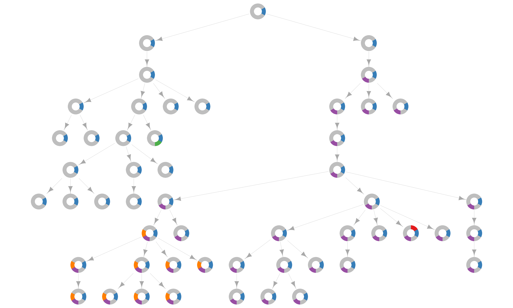

# Summary

This R [@R] package, `mitolina` (**MITO**chondrial **LIN**eage **A**nalysis), contains functionality to simulate and analyse populations of mitochondrial genomes (mitogenomes). This is achieved using both R and C++ via Rcpp [@Rcpp] for efficient computations. 

Mitochondria are of interest for example in forensic genetics as they are very resistant to degradation 
and it is sometimes possible to construct a mitochondrial DNA profile when it is not possible to construct a 
traditional DNA profile [@Butler2009; @AndersenPLOSGENmtDNA2018].
This happens for example when the biological sample does not contain cell nuclei or when the 
sample is degraded (for example by time or environment).

Just as DNA profiles based on the Y chromosome are paternal lineage markers (inherited from fathers to boys) [@Butler2009; @AndersenPLOSGEN2017], 
then DNA profiles based on the mitogenome are maternal lineage markers (inherited from mothers to children) [@Butler2009; @AndersenPLOSGENmtDNA2018]. 
It is often helpful to perform simulations of populations in lineage marker research as 
recent research on using Y chromosomal DNA profiles in forensic genetics 
demonstrate [@AndersenCoalescent2013; @AndersenDisclap2013; @AndersenPLOSGEN2017; @AndersenMalan2018]. 

This R package, `mitolina`, is based on the R package `malan` [@AndersenMalan2018] that simulates populations of Y chromosomes. 
The packages are funamentally different in two aspects caused by the way that paternal and maternal lineage markers behave genetically.  
For example, with the mitogenome it is necessary to simulate both females and males (as males have their mother's mitogenome), at least in the generations where the profiles must be used. Also, the genetic DNA profiles used in forensic genetics are different for the two types of lineage markers. 
A mitogenomic DNA profile can be seen as a profile of many thousands binary markers whereas a Y-profile consists of 10-20 integer valued markers.

The simulation model allows for flexible simulations by first simulating a genealogy (with population sizes at each generation specified by a vector for number of females and a vector for number of males) with various parameters such as variance in reproductive success [@AndersenPLOSGEN2017]. 
It is possible to impose mitogenomes in various ways and several sets of mutation rates are included [@Soares2009; @Rieux2014; @Oversti2017]. 
There are also 588 forensic-quality haplotypes representing three U.S. populations from [@Just2015] included; they can for example be used to distribute founder haplotypes.

The `mitolina` software makes it possible to query the population and its individuals in multiple ways. For example to count the number of females or males in the population with a certain mitogenome. Or obtain the distribution of number of meioses between a queried contributor and the individuals in the population with a matching mitogenome.

The documentation of `mitolina` consists of manual pages for the various available functions, an article describing how to use the package (*vignette*), and unit tests.

Research using this software in interpretation of DNA profiles based on the 
mitogenome in forensic genetics is already published [@AndersenPLOSGENmtDNA2018] 
and the aim is that this software can help further research in this important topic. 

I would like to thank David J Balding for helpful discussions.

# References
